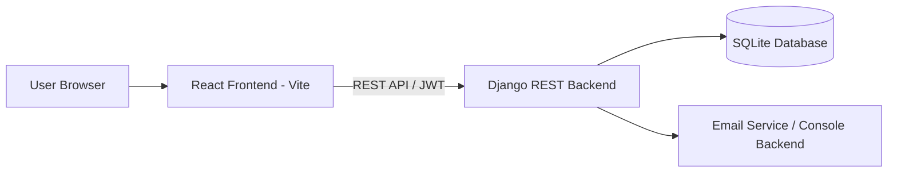
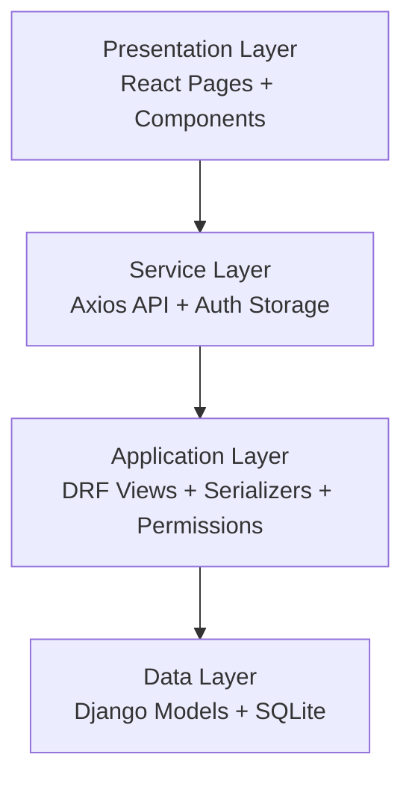
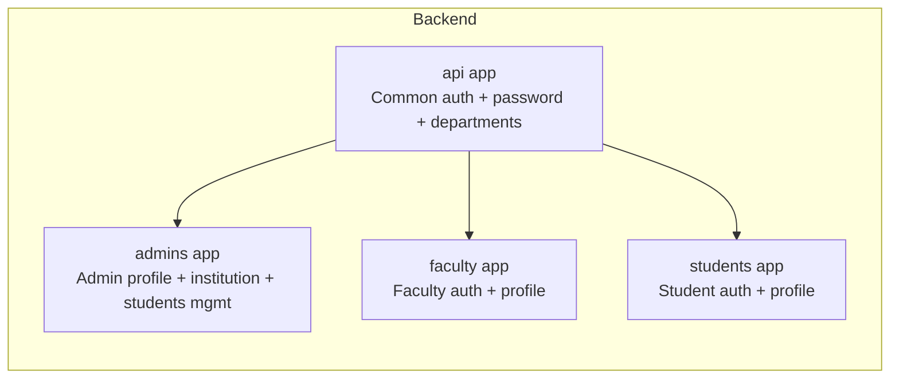
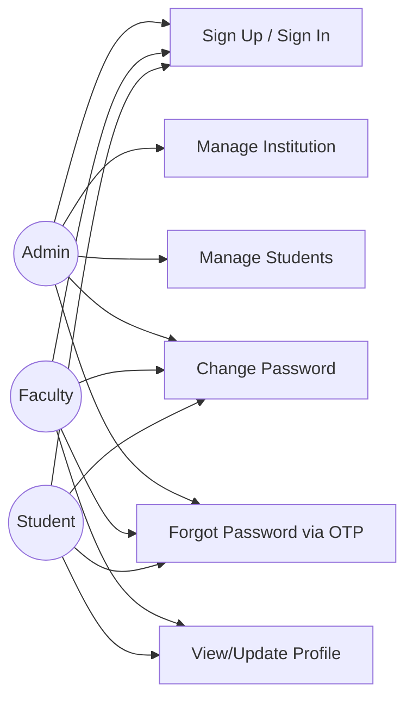
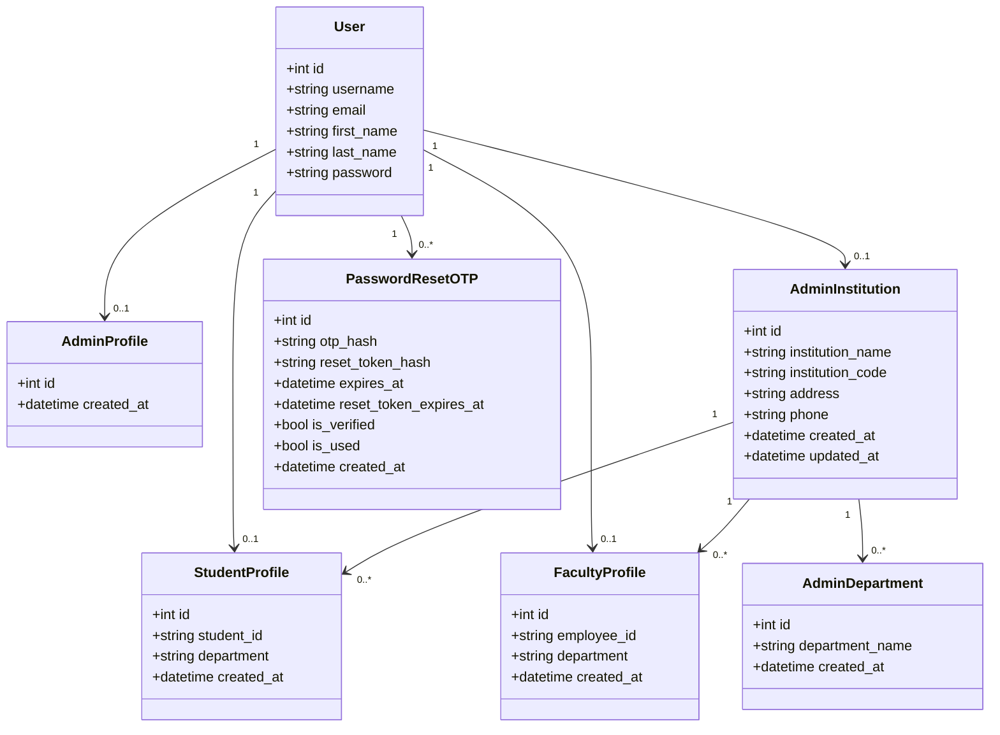
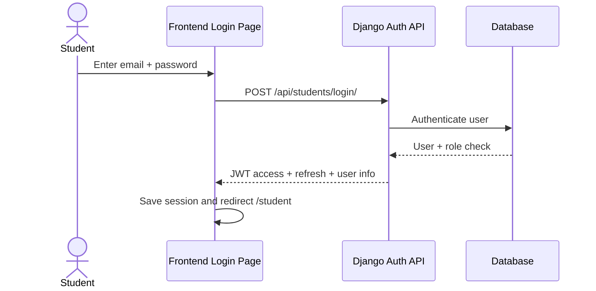
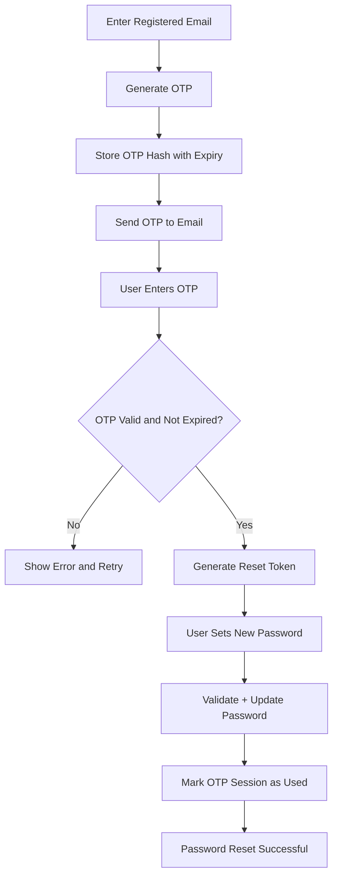

# 1. Title Page

**PROJECT TITLE:** ExamAI - Smart Examination and Academic Management System  
**Submitted By:** [Your Name]  
**Enrollment No.:** [Your Enrollment Number]  
**Program:** Master of Computer Applications (MCA)  
**Semester:** [Semester]  
**Institute:** Faculty of Computer Applications & Information Technology, GLS University  
**Academic Year:** 2025-26  
**Submitted To:** [Guide Name / Project Mentor]

---

# 2. College Certificate (Not For You)

(As per college-provided format. Keep this page reserved for official certificate, signature, and seal.)

---

# 3. Acknowledgement

I express my sincere gratitude to the Faculty of Computer Applications & Information Technology, GLS University, for providing me the opportunity to undertake and complete this MCA mini project titled **"ExamAI - Smart Examination and Academic Management System."**

I would like to thank my project guide, faculty members, and all teaching staff for their valuable guidance, motivation, and continuous support throughout the project development lifecycle.

I am also thankful to my classmates and friends for their suggestions and feedback during design and implementation. Finally, I thank my family for their encouragement and support, which helped me complete this project successfully.

---

# 4. Index

1. Title Page  
2. College Certificate (Not For You)  
3. Acknowledgement  
4. Index  
5. Introduction  
6. Project Definition  
7. Project Profile  
8. Tools and Technology  
9. Feasibility Study  
10. Modules of the System  
11. Features of the System  
12. Users of the System  
13. Architecture Diagram  
14. UML Diagrams (Class, Use Case, Sequence, Activity)  
15. Database Design (Data Dictionary)  
16. GUI Design (Mock Screens)  
17. MIS Reports Design  
18. Conclusion

---

# 5. Introduction

The education sector has rapidly moved toward digital-first operations. Traditional examination management methods are often fragmented, time-consuming, and error-prone. Academic institutions need a reliable platform to handle role-based user management, authentication, student data administration, and academic workflow automation.

**ExamAI** is a web-based full-stack application developed to support modern exam administration and profile management in a role-based educational environment. The system is built with a **Django REST API backend** and a **React + Vite frontend**, supporting three main users: **Admin, Faculty, and Student**.

The project focuses on practical institution-level needs:
- Secure registration/login for different academic roles.
- Institution configuration and department structure handling.
- Student master management by admin.
- Self-service profile management for students and faculty.
- Password security features with OTP-based reset flow.

The project architecture is modular, scalable, and suitable as a foundation for advanced features such as question bank management, exam generation, evaluation, and analytics.

---

# 6. Project Definition

## 6.1 Problem Statement
Educational institutions often face challenges in handling user onboarding, role segregation, and academic record administration across admin, faculty, and student actors. Manual methods create delays, data inconsistency, and weak security controls.

## 6.2 Proposed Solution
Develop a role-based examination management platform, **ExamAI**, that provides:
- Centralized and secure user authentication.
- Institution and department setup for academic governance.
- Admin-controlled student lifecycle management (create/read/update/delete).
- Profile interfaces for students and faculty.
- Secure password change and OTP-driven password recovery.

## 6.3 Project Objectives
- Build a secure and scalable full-stack academic web app.
- Implement role-based API authorization and frontend route protection.
- Reduce manual processing in student administration.
- Ensure maintainable code structure and reusable API contracts.

## 6.4 Scope
### In Scope
- Admin, faculty, and student authentication.
- Institution information management.
- Department listing and synchronization.
- Student data management by admin.
- Password reset using OTP and reset token.

### Future Scope
- Exam creation and scheduling workflow.
- AI-based question generation and proctoring.
- Marks entry and report card automation.
- Advanced dashboard analytics and downloadable reports.

---

# 7. Project Profile

## 7.1 Project Name
**ExamAI - Smart Examination and Academic Management System**

## 7.2 Domain
EdTech / Academic Information Management / Examination Automation

## 7.3 Type
Full-Stack Web Application (REST API + SPA Frontend)

## 7.4 Development Methodology
Iterative and module-based development with role-wise implementation:
1. Backend API design and role models.
2. Authentication and authorization.
3. Frontend integration with API services.
4. Testing, validation, and UI refinement.

## 7.5 Project Highlights
- JWT-based authentication with token refresh.
- Custom role permissions (Admin/Faculty/Student).
- Dynamic institution and department handling.
- Structured app-wise backend modules (`api`, `admins`, `faculty`, `students`).
- Responsive frontend pages for each role.

---

# 8. Tools and Technology

## 8.1 Backend
- **Python 3.x**
- **Django 6.0.3**
- **Django REST Framework 3.17.0**
- **Simple JWT 5.5.1**
- **django-cors-headers 4.9.0**
- **SQLite** (development database)

## 8.2 Frontend
- **React 18**
- **TypeScript**
- **Vite 6**
- **React Router 7**
- **Axios** (HTTP client)
- **TailwindCSS** + component libraries

## 8.3 Development Environment
- **VS Code**
- **Git/GitHub**
- **Postman/Browser API testing**

## 8.4 Architecture Style
- Client-Server architecture
- RESTful API communication
- Token-based stateless authentication

---

# 9. Feasibility Study

## 9.1 Technical Feasibility
The chosen technology stack is widely adopted, open source, and suitable for educational applications. Django REST Framework supports rapid API development and robust security patterns. React + Vite provides fast frontend development and responsive UI behavior.

## 9.2 Economic Feasibility
The project uses free/open-source technologies. Hardware and software requirements are minimal. Deployment can start at low cost using cloud or institutional servers.

## 9.3 Operational Feasibility
The system offers role-specific dashboards and simple forms, reducing training time. Admins can perform core management tasks quickly, improving process efficiency.

## 9.4 Schedule Feasibility
The project can be completed in staged sprints:
- Week 1-2: Requirement analysis and design
- Week 3-5: Backend module development
- Week 6-8: Frontend module integration
- Week 9-10: Testing, bug fixing, documentation

## 9.5 Legal and Security Feasibility
The system enforces authentication, role-based API access, password policies, and OTP reset flow. Sensitive data (OTP/reset token) is hash-protected in storage.

---

# 10. Modules of the System

## 10.1 Authentication Module
- User signup/login for admin, faculty, student
- JWT access and refresh token handling
- Role included in token payload
- Authenticated user identity endpoint (`auth/me`)

## 10.2 Admin Module
- Admin profile creation and validation
- Institution details create/view/update
- Department catalog loading
- Student management (list/search/filter/create/update/delete)

## 10.3 Faculty Module
- Faculty signup/login
- Faculty profile generation and viewing
- Employee ID auto-generation (`FAC-YYYY-XXX`)
- Department update by faculty user

## 10.4 Student Module
- Student signup/login
- Student profile generation and viewing
- Student ID auto-generation (`STU-YYYY-XXXX`)
- Department update by student user

## 10.5 Password Management Module
- Change password (authenticated flow)
- Forgot password (email + OTP)
- OTP verification and reset session token
- Password reset with validation and secure expiry

## 10.6 Frontend Access Control Module
- Role-based protected routes
- Automatic session sync via `auth/me`
- Token refresh interceptor and request retry

---

# 11. Features of the System

1. Multi-role authentication (Admin/Faculty/Student).
2. JWT-based secure API access.
3. Role-specific dashboard routing.
4. Admin institution profile with unique institution code.
5. Auto-generated IDs for student and faculty records.
6. Department management and synchronization.
7. Student listing with search and department filters.
8. Student CRUD operations by admin.
9. Password change with validation rules.
10. OTP-based forgot password flow.
11. Reset token expiry and one-time use security.
12. Frontend-backend integration with reusable service layer.
13. CORS handling and cross-origin API consumption.
14. Responsive and modern user interface.

---

# 12. Users of the System

## 12.1 Admin
### Responsibilities
- Register/login as institution admin.
- Create/update institution information.
- Manage student records.
- View department-wise student data.

### Permissions
- Full access to admin endpoints.
- Access to department and student management APIs.

## 12.2 Faculty
### Responsibilities
- Register/login as faculty.
- Maintain own profile and department.
- Access faculty dashboard pages.

### Permissions
- Faculty-only profile APIs.
- No admin-level student CRUD privileges.

## 12.3 Student
### Responsibilities
- Register/login as student.
- Maintain profile and department.
- Access student dashboard pages.

### Permissions
- Student-only profile APIs.
- No faculty/admin privileged actions.

## 12.4 System Actor (Mail Service)
- Sends OTP for forgot password flow.
- Uses SMTP or console backend based on environment.

---

# 13. Architecture Diagram

## 13.1 High-Level Architecture

## 13.2 Logical Layering

## 13.3 Backend App Structure

---

# 14. UML Diagrams

## 14.1 Use Case Diagram

## 14.2 Class Diagram

## 14.3 Sequence Diagram (Student Login)

## 14.4 Activity Diagram (Forgot Password)

---

# 15. Database Design (Data Dictionary)

## 15.1 Main Tables
The project uses SQLite and Django ORM. Core entities are listed below.

## 15.2 Data Dictionary

### Table: auth_user (Django built-in)
| Field | Type | Constraints | Description |
|---|---|---|---|
| id | Integer | PK, Auto | Unique user ID |
| username | Varchar(150) | Unique, Required | Used as login username (email) |
| email | Varchar(254) | Optional | User email |
| first_name | Varchar(150) | Optional | First name |
| last_name | Varchar(150) | Optional | Last name |
| password | Varchar(128) | Required | Hashed password |
| is_active | Boolean | Default True | Account status |
| date_joined | DateTime | Auto | Creation timestamp |

### Table: admins_adminprofile
| Field | Type | Constraints | Description |
|---|---|---|---|
| id | Integer | PK | Admin profile ID |
| user_id | Integer | FK -> auth_user.id, OneToOne | Linked user |
| created_at | DateTime | Auto | Record creation time |

### Table: admins_admininstitution
| Field | Type | Constraints | Description |
|---|---|---|---|
| id | Integer | PK | Institution record ID |
| admin_id | Integer | FK -> auth_user.id, OneToOne | Owning admin |
| institution_name | Varchar(255) | Required | Institution name |
| institution_code | Varchar(13) | Unique, Auto | Code like INST-2026-001 |
| address | Varchar(500) | Optional | Institution address |
| phone | Varchar(20) | Optional | Contact number |
| created_at | DateTime | Auto | Creation timestamp |
| updated_at | DateTime | Auto-update | Last update timestamp |

### Table: admins_admindepartment
| Field | Type | Constraints | Description |
|---|---|---|---|
| id | Integer | PK | Department record ID |
| institution_id | Integer | FK -> admins_admininstitution.id | Parent institution |
| department_name | Varchar(120) | Required | Department label |
| created_at | DateTime | Auto | Creation timestamp |

Unique Constraint: (`institution_id`, `department_name`)

### Table: students_studentprofile
| Field | Type | Constraints | Description |
|---|---|---|---|
| id | Integer | PK | Student profile ID |
| user_id | Integer | FK -> auth_user.id, OneToOne | Linked user |
| institution_id | Integer | FK -> admins_admininstitution.id, Nullable | Linked institution |
| student_id | Varchar(13) | Unique, Auto | ID like STU-2026-0001 |
| department | Varchar(120) | Optional | Student department |
| created_at | DateTime | Auto | Creation timestamp |

### Table: faculty_facultyprofile
| Field | Type | Constraints | Description |
|---|---|---|---|
| id | Integer | PK | Faculty profile ID |
| user_id | Integer | FK -> auth_user.id, OneToOne | Linked user |
| institution_id | Integer | FK -> admins_admininstitution.id, Nullable | Linked institution |
| employee_id | Varchar(12) | Unique, Auto | ID like FAC-2026-001 |
| department | Varchar(120) | Optional | Faculty department |
| created_at | DateTime | Auto | Creation timestamp |

### Table: api_passwordresetotp
| Field | Type | Constraints | Description |
|---|---|---|---|
| id | Integer | PK | OTP session ID |
| user_id | Integer | FK -> auth_user.id | Linked user |
| otp_hash | Varchar(255) | Required | Hashed OTP |
| reset_token_hash | Varchar(255) | Optional | Hashed reset token |
| expires_at | DateTime | Required | OTP expiry time |
| reset_token_expires_at | DateTime | Nullable | Reset token expiry |
| is_verified | Boolean | Default False | OTP verified flag |
| is_used | Boolean | Default False | One-time usage flag |
| created_at | DateTime | Auto | Creation timestamp |

## 15.3 ER Relationship Summary
- One user can have exactly one role profile (admin/faculty/student).
- One admin user can create one institution profile.
- One institution has multiple departments.
- One institution can have multiple students and faculty profiles.
- One user can have multiple OTP reset records over time.

---

# 16. GUI Design (Mock Screens)

Below is the screen inventory for UI documentation. Capture screenshots from the running frontend and place each under this heading.

## 16.1 Public Screens
1. Landing Page
2. Login/Signup Page (role selector)
3. Forgot Password - Email submission
4. Forgot Password - OTP verification
5. Forgot Password - Reset password

## 16.2 Admin Screens
1. Admin Dashboard
2. Admin Students List (search/filter)
3. Add Student Modal
4. View Student Modal
5. Edit Student Modal
6. Admin Settings - Institution
7. Admin Settings - Exam/Notification/Security

## 16.3 Faculty Screens
1. Faculty Dashboard
2. Generate Paper
3. Exam History
4. Faculty Settings/Profile

## 16.4 Student Screens
1. Student Dashboard
2. Student Exams
3. Student Performance
4. Student Settings/Profile
5. Exam Interface
6. Result Page

## 16.5 Mock Wireframe Notes
- Use consistent sidebar navigation by role.
- Keep top metrics cards on dashboard pages.
- Use data table for student management.
- Highlight forms with validation messages.
- Keep responsive layout for mobile and desktop.

---

# 17. MIS Reports Design

MIS (Management Information System) reports provide decision support for institution administrators and faculty.

## 17.1 Report 1: Department-wise Student Count
**Purpose:** Track student distribution across departments.

Columns:
- Sr. No.
- Department Name
- Total Students
- Percentage of Institution Total

## 17.2 Report 2: Student Master Register
**Purpose:** Complete student directory for audit and administration.

Columns:
- Student ID
- Full Name
- Email
- Department
- Institution Code
- Created Date

## 17.3 Report 3: New Registrations Summary
**Purpose:** Monitor recent onboarding activity.

Columns:
- Date
- New Students
- New Faculty
- New Admin Accounts

## 17.4 Report 4: Institution Profile Report
**Purpose:** Snapshot of institution setup quality.

Columns:
- Institution Name
- Institution Code
- Address
- Phone
- Last Updated On

## 17.5 Report 5: Password Reset Audit (Security Report)
**Purpose:** Monitor reset activity and detect misuse.

Columns:
- User Email
- OTP Requested Time
- OTP Verified
- Reset Completed
- Status (Used/Expired/Active)

## 17.6 Report Generation Format
- On-screen tabular view.
- CSV export (future enhancement).
- PDF printable format (future enhancement).

---

# 18. Conclusion

The **ExamAI** project successfully demonstrates the development of a secure, role-based educational management platform using modern full-stack technologies.

The application achieves its primary objectives:
- Role-specific authentication and access control.
- Institution and student administration workflows.
- Faculty/student self-profile management.
- Security-enhanced password management with OTP verification.

This project provides a practical and expandable base for advanced examination functionalities such as exam scheduling, question bank automation, AI-supported paper generation, result analytics, and MIS intelligence.

From an MCA academic perspective, this project reflects strong understanding of:
- Software engineering lifecycle
- Database and API design
- Frontend-backend integration
- Security and user management
- Modular and scalable architecture

The system is suitable for academic demonstration and can be further evolved into a production-grade institutional examination platform.

---

## Appendix A: Sample API Endpoints

- `POST /api/admins/signup/`
- `POST /api/admins/login/`
- `GET|POST|PUT /api/admin/institution`
- `GET|POST /api/admin/students`
- `GET|PUT|DELETE /api/admin/students/{id}`
- `POST /api/students/signup/`
- `POST /api/students/login/`
- `GET|PUT /api/student/profile`
- `POST /api/faculty/signup/`
- `POST /api/faculty/login/`
- `GET|PUT /api/faculty/profile`
- `GET /api/auth/me`
- `POST /api/auth/change-password`
- `POST /api/auth/forgot-password`
- `POST /api/auth/verify-otp`
- `POST /api/auth/reset-password`
- `POST /api/token/refresh/`

## Appendix B: Suggested Page Count Planning (30-40 Pages)

1. Title + Certificate + Acknowledgement + Index: 4 pages  
2. Introduction + Definition + Profile + Tools: 6 pages  
3. Feasibility + Modules + Features + Users: 8 pages  
4. Architecture + UML diagrams: 6 pages  
5. Database design + Data dictionary: 6 pages  
6. GUI mock screens (with screenshots): 6-8 pages  
7. MIS reports + Conclusion + References: 3-4 pages
